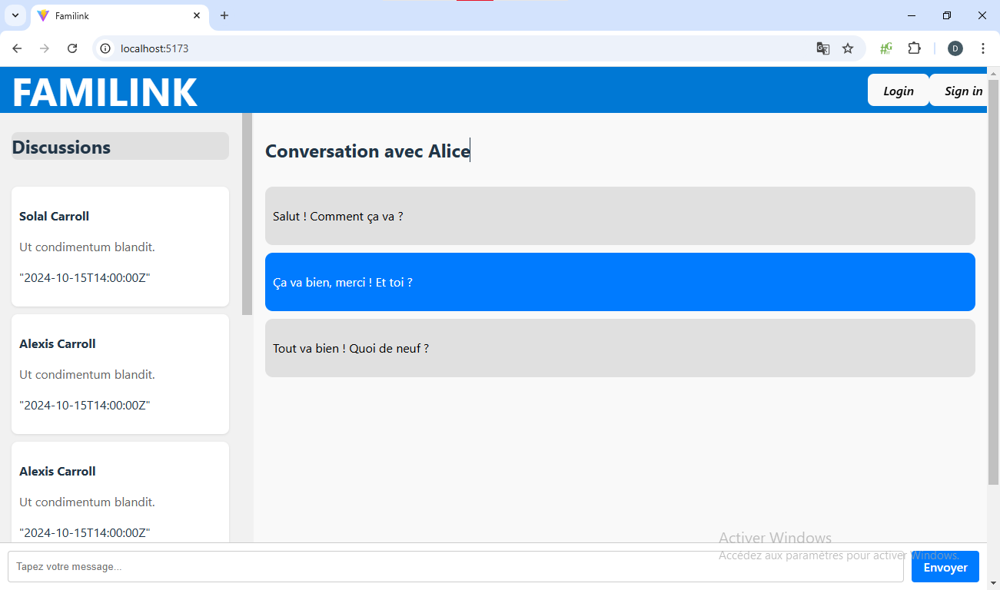
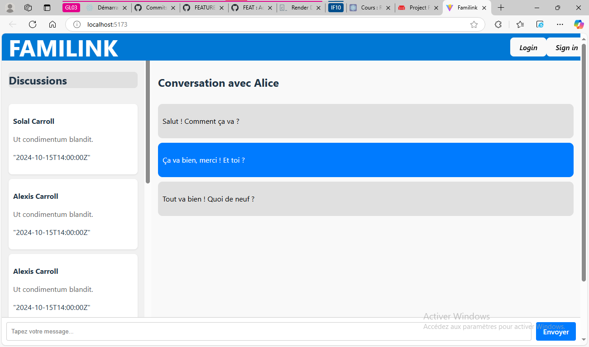
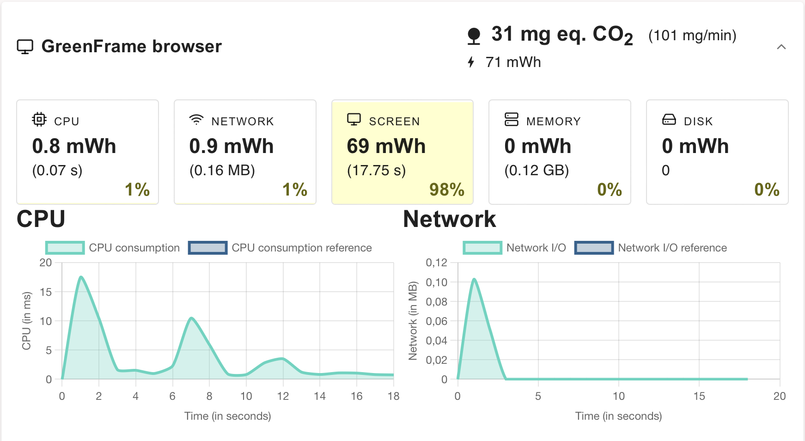
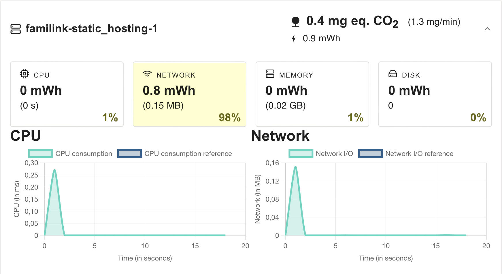
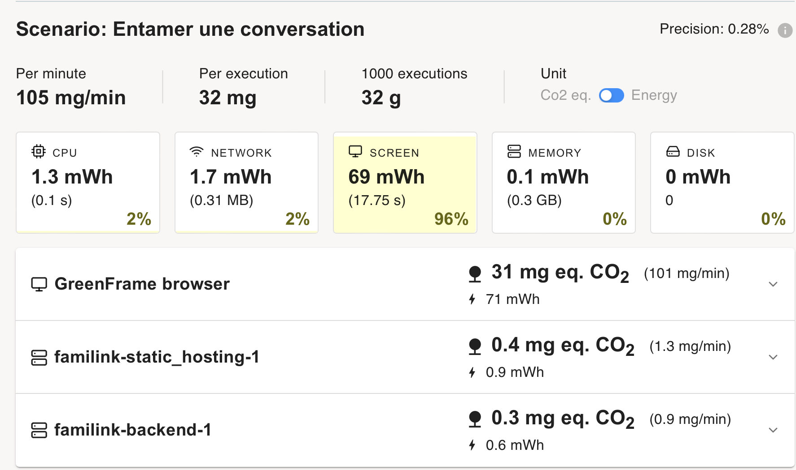
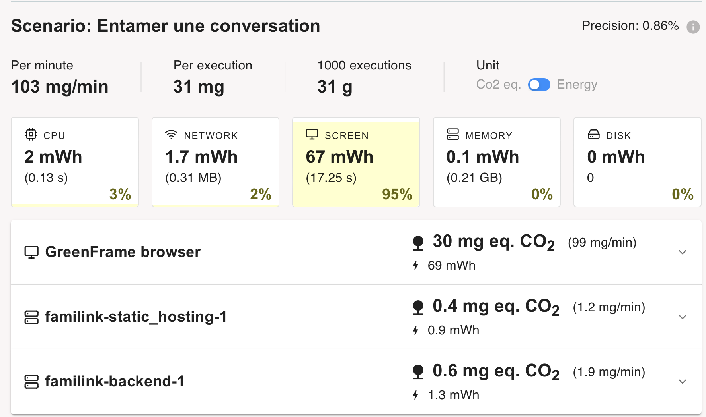
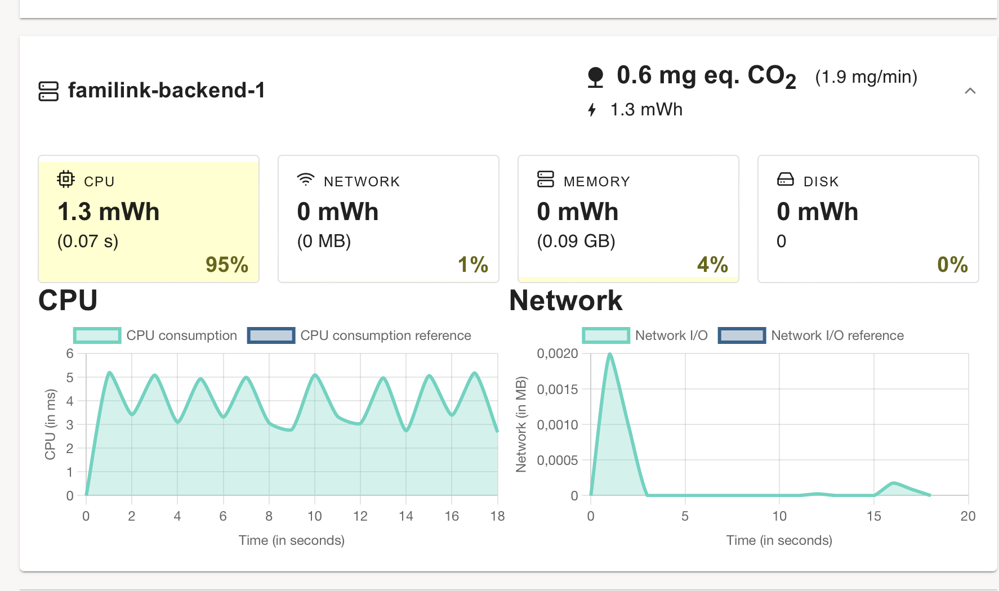

# FAMILINK
Se soucier de sa famille et de l’environnement
---

Choix du sujet 
Choix du sujet 
---

Personnellement, nous utilisons chaque jour différentes messageries pour garder contact avec nos proches. Que ça soit pour contacter la famille dans un pays étranger ou pour garder contact avec des groupes d’amis pour des activités sportives, les messageries sont pour nous des outils essentiels.

De plus, notre exemple s’applique à l’ensemble du monde car il y aurait au dela de 5 Milliards d'individus qui utiliseraient des messagerie instantanées [(Source : Statista)]( https://fr.statista.com/statistiques/564407/applis-de-messagerie-mobiles-les-plus-populaires-dans-le-monde-en/) soit près de 70% de la population mondiale.
De plus, notre exemple s’applique à l’ensemble du monde car il y aurait au dela de 5 Milliards d'individus qui utiliseraient des messagerie instantanées [(Source : Statista)]( https://fr.statista.com/statistiques/564407/applis-de-messagerie-mobiles-les-plus-populaires-dans-le-monde-en/) soit près de 70% de la population mondiale.

Utilité Sociale
---

Une famille comporte des caractéristiques propres qui ne s’appliquent pas nécessairement à d’autres groupes d’individus. En effet, une famille comporte jusqu’à 3 voire 4 générations et entretenir des liens malgré les aléas de la vie peut parfois s’avérer compliqué. Par exemple une mutation dans un poste éloigné ou encore le départ des enfants pour leurs études. De plus, ces différentes générations possèdent souvent des habitudes différentes, les personnes âgées se lèvent plus tôt et se couchent plus tôt tandis que les jeunes souvent plus tard, rendant les interactions plus compliquées. La messagerie offre aussi une alternative aux appels qui peuvent être chronophages et parfois perçus comme une corvée là ou ils devraient être un plaisir. De ce fait, grâce à la messagerie tout le monde répond quand il en a l’occasion et non plus par obligation. Ce dispositif permettrait donc d’éviter, ou à minima de limiter, l’isolation sociale et la solitude pour tous les membres de la famille.

Effets de la numérisation
---   

Il n’y a pas de réelle substitution physique à la messagerie instantanée à part peut-être les lettres qui ont rapidement disparu comme moyen de communication informelle après l’arrivée d’internet et des téléphones. A titre informatif une lettre verte envoyée par La Poste de Paris à Marseille consomme l’équivalent de 21,6 g de CO2[(Source : Jean-Pierre Guéno)](https://www.linkedin.com/pulse/mail-versus-courrier-papier-qui-est-le-bon-élève-jean-pierre-guéno/). Notre application est donc une réponse numérique à un problème qui n’en avait pas jusqu’alors. Cependant les messageries existantes sont beaucoup plus gourmandes qu’elles ne pourraient l’être notamment à cause :
- de l’ajout de publicités,
- du manque d’optimisation,
- de fonctionnalités supplémentaires sans réelle valeur ajoutée,
- de partage de fichiers volumineux.

Scénarios d'usage et impacts
---

Nous prenons pour hypothèse que notre utilisateur se connecte régulièrement à notre application afin de garder le contact avec les membres de sa famille. Prenant cela en considération, nos scénarios d'usage se baseront sur les deux comportements qui seront les plus observés chez nos utilisateurs : l'entame d'une conversation et la consultation des messages.

Scénario 1 : "Entamer une conversation"
---

1. L'utilisateur se rend sur l'application web
2. L'utilisateur sélectionne un contact
3. L'utilisateur rédige son message
4. L'utilisateur envoie son message

Scénario 2 : "Consulter ses messages"
---

1. L'utilisateur se rend sur l'application web
2. L'utilisateur selectionne une conversation
3. L'utilisateur selectionne une autre conversation
4. L'utilisateur selectionne une autre conversation
5. L'utilisateur selectionne une autre conversation

Impact de l'execution du scénario auprès du service concurrent Discord
---
L'EcoIndex d'une page (de A à G) est calculé (sources : [EcoIndex](https://www.ecoindex.fr/comment-ca-marche/), [Octo](https://blog.octo.com/sous-le-capot-de-la-mesure-ecoindex), [GreenIT](https://github.com/cnumr/GreenIT-Analysis/blob/acc0334c712ba68939466c42af1514b5f448e19f/script/ecoIndex.js#L19-L44)) en fonction du positionnement de cette page parmi les pages mondiales concernant :

- le nombre de requêtes lancées,
- le poids des téléchargements,
- le nombre d'éléments du document.

Nous avons décidé de comparer l'impact des scénarios sur les application web des messageries Discord et Whatsapp. Les résultats sont les suivants :

- [Scénario 1](https://github.com/UTT-GL03/FAMILINK/tree/main/GreenIT%20Data/Scenario_1)

#### Scénario appliqué avec Discord
  |       |EcoIndex|GES(gCO2e)|Taille du DOM|Requêtes|Taille de la page (ko)|
  |-------|--------|----------|-------------|--------|----------------------|
  |1. L'utilisateur se rend sur l'application web|51,18 D🟡| 1,98    |  225        |  116   |        25458         |
  |2. L'utilisateur sélectionne un contact ou un groupe de famille|27,29 E🟡| 2,45 | 647 | 216 | 29483 |
  |3. L'utilisateur rédige son message | 27,29 E🟡| 2,45 | 647 | 216 | 29483 |
  |4. L'utilisateur envoie son message | 26,71 E🟡 | 2,47 | 656 | 228 | 29533|

#### Scénario appliqué avec Whatsapp Web
  |       |EcoIndex|GES(gCO2e)|Taille du DOM|Requêtes|Taille de la page (ko)|
  |-------|--------|----------|-------------|--------|----------------------|
  |1. L'utilisateur se rend sur l'application web|35,26 E🟡| 2,29    |  733        |  92   |        31720         |
  |2. L'utilisateur sélectionne un contact ou un groupe de famille|19,74 F🟠| 2,61 | 891 | 237 | 32302 |
  |3. L'utilisateur rédige son message | 19,72 F🟠| 2,61 | 889 | 240 | 32303 |
  |4. L'utilisateur envoie son message | 19,25 F🟠 | 2,62 | 909 | 240 | 32303|
  
- [Scénario 2](https://github.com/UTT-GL03/FAMILINK/tree/main/GreenIT%20Data/Scenario_2)

#### Scénario appliqué avec Discord
  |       |EcoIndex|GES(gCO2e)|Taille du DOM|Requêtes|Taille de la page (ko)|
  |-------|-------------|----------|-------------|--------|----------------------|
  |1. L'utilisateur se rend sur l'application web|30,45 E🟡| 2,39    |  607        |  175   |        8064        |
  |2. L'utilisateur selectionne une conversation|30,45 E🟡| 2,39 | 607 | 175 | 8064 |
  |3. L'utilisateur selectionne une autre conversation | 26,56 E🟡| 2,47 | 655 | 240 | 9926 |
  |4. L'utilisateur selectionne une autre conversation | 17,73 F🟠 | 2,65 | 948 | 271 | 10336|
  |5. L'utilisateur selectionne une autre conversation | 6,22 G🔴 | 2,88 | 2144 | 294 | 10849|

#### Scénario appliqué avec Whatsapp Web
  |       |EcoIndex|GES(gCO2e)|Taille du DOM|Requêtes|Taille de la page (ko)|
  |-------|--------|----------|-------------|--------|----------------------|
  |1. L'utilisateur se rend sur l'application web|35,14 E🟡| 2,30    |  749       |  90   |        27319        |
  |2. L'utilisateur selectionne une conversation|18,94 F🟠| 2,62 | 923 | 239 | 32305 |
  |3. L'utilisateur selectionne une autre conversation |11,60 F🟠| 2,77 | 1359 | 255 | 33090 |
  |4. L'utilisateur selectionne une autre conversation | 11,48 F🟠 | 2,77 | 1370 | 255 | 33090|
  |5. L'utilisateur selectionne une autre conversation | 13,54 F🟠 | 2,73 | 1195 | 259 | 33256|

Chaque capture d'écran correspond à l'étape correspondante dans les scénarios avec le suffixe _ds pour discord et _ws pour whatsapp web. On peut remarquer que Discord est légèrement plus sobre ecologiquement que whatsapp excepté dans le cas du partage d'image ou de liens.

La réalisation de ces scénarios nous montre que l'impact écologique est déjà énorme dès l'arrivée sur le site, ensuite on voit que lors de la sélection d'une conversation le chargement des données a lui aussi un fort impact. Pour le premier point, on peut expliquer cela par la présence de publicités parfois ou encore de mauvaise optimisation de l'application. Pour ce qui est de la sélection des conversations, on peut remarquer que les conversations avec des liens, images ou encore des GIFs ont un grand impact. Pour ces raisons, notre applications n'aura bien évidemment pas de publicités, ne proposera pas l'envoi de fichiers multimédias (en tout cas dans un premier temps) et proposera un design simple et basique pour optimiser un maximum les performances.

Maquette de l'interface et échantillon de données
---

Notre travail portant sur un service de messagerie web, nous avons une seule interface qui nous permet de visualiser et comprendre les différents scénarios retenus.

__Fig.1__: Maquette de l'interface du prototype

Pour des raisons de respect des droits d'auteurs, nous utilisons des données générées (avec [`dummy-json`](https://dummyjson.com)).
Bien que fictives, ces données correspondent à la structure des services concurrents : un ensemble de conversation appartenant à un utilisateur (voir [modèle de données](./frontend/sample_data.hbs)).

## Prototype n°1 : Fonctionnalités pour le scénario prioritaire avec des données chargées de manière statique

Pour la première version de notre prototype: 

- les données sont chargées de manière statique.
- les  fonctionnalités implémentées sont la lecture et l'envoi des messages

Notre interface permet de charger dans la barre de discussion les conversations qu'on a avec différentes personnes et nous n'avons plus qu'à cliquer sur une conversation pour afficher les messages relatifs.

Lors du chargement de la page, nous avons une conversation qui s'affiche directement

### Conversations

_Fig.2_: Prototype 1 : affichage de la conversation de base

|    | EcoIndex | GES (gCO2e) | Taille du DOM | Requêtes | Taille de la page (ko) |
|----|----------|-------------|---------------|----------|------------------------|
| 1. L'utilisateur se rend sur l'application web | 79,21🟢 | 1.42 | 188 | 23 |  1296 |

_Tab1_: Evaluation de l'impact sur la page d'accueil

_Fig.3_: Prototype 1 : conversation avec Solal

|    | EcoIndex | GES (gCO2e) | Taille du DOM | Requêtes | Taille de la page (ko) |
|----|----------|-------------|---------------|----------|------------------------|
| 1. L'utilisateur sélectionne une conversation | 78,70🟢 | 1.43 | 188 | 28 |  1296

Comme nous l'avions prévu, l'interface étant très épuré et la seule présence de messages textuels rendent notre application respectueuse de l'environnement.

## Prototype n°2 : Fonctionnalités pour le scénario prioritaire avec données statiques chargées de manière dynamique

Dans cette nouvelle version du prototype, le frontend récupère désormais les données statiques via le réseau après un premier affichage vide. Cette approche, plus proche d’un fonctionnement réel, ajoute une requête par page affichée.

Sur le plan de l’impact environnemental, les résultats restent globalement inchangés par rapport à la version précédente, à l’exception d’une requête supplémentaire. À ce stade, l’EcoIndex ne devrait plus varier de manière notable, sauf en cas de changements importants. Pour aller plus loin, nous passerons à l’utilisation de GreenFrame, un outil d’analyse qui mesure de façon précise l’impact direct des consultations en s’appuyant sur les données d’utilisation des ressources matérielles (CPU, mémoire, réseau, disque), sans intégrer le cycle de vie du terminal. Cependant, étant donné que les différentes applications de messagerie possèdent toutes une étape d'identification, il est impossible pour nous de les analyser avec GreenFrame. C'est pour cette raison que pendant la suite de notre rapport nous serons dans l'incapacité de comparer notre application à des services existants et nous baserons donc seulement sur nos propres mesures.

Nous pouvons remarquer, que dans notre prototype, on a 2 pics significatifs de CPU à 1 et 7 secondes (voir Fig.4) et un pic de réseau lui aussi à 1 seconde. Contrairement à ce que nous pensions, le CPU et le réseau ne représentent que 5% de la consommation totale de notre application, les 95% restants sont quand à eux consommé par l'écran.

_Fig.4_: Prototype 2 : Impact du CPU et du Réseau

Le second atout de GreenFrame est que nous pouvons désormais simuler et mesurer la partie "serveur" de notre application (voir Fig.5). Cependant, pour cette partie, comme les données sont toujours statique, son impact est négligeable par rapport à la consommation du client (1,3%).

_Fig.5_: Prototype 2 : Impact du serveur

##Prototype n°3 : Fonctionnalités pour le scénario prioritaire avec données stockées dans une base de données

Pour cette troisième version du prototype, nous avons ajouté une base de données avec un API Web (CouchDB). L'intérêt pour nous de fonctionner avec une base de données est que dans on premier temps, la pagination de notre application pourra être facililité tout comme le filtrage des conversations. De plus, en étendant notre application à plus grande échelle nous pourrions avoir une base de données qui avec une simple requête pourrait fournir toutes les conversations de l'utilisateur connecté.

Comme nous n'avions pas fait les mesures GreenFrame avant d'ajouter le backend dans notre docker, nous ne pouvons pas remarquer la différence drastique causé par celui ci lors du passage du prototype 2 au prototype 3. Nous pouvons cependant remarquer que le passage à la Base de données a tout de même augmenter la consommation du CPU de 0,7 mWH avec 0,03 secondes d'utilisation de plus (voir Fig.6).

_Fig.6_: Comparaison des prototypes 2 et 3

Cette utilisation du CPU est bien visible grâce a GreenFrame dans la section backend qui représente l'utilisation de la base de données (voir Fig.7).

_Fig.7_ : Impact Ecologique de l'ajout de la base de données

Toutes ces mesures nous indique pour l'instant que l'ajout d'une base de données n'est pas bénéfique pour l'environnement, cependant ce choix de conception devrait être "rentabilisé" avec l'augmentation de la quantité de données à traiter.
