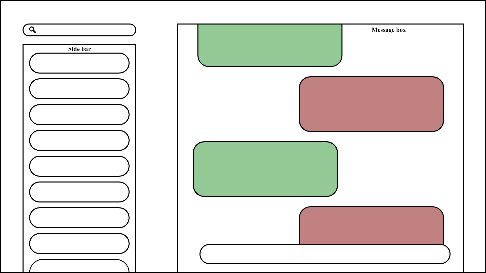

# FAMILINK
Se soucier de sa famille et de l’environnement
---

Choix du sujet 
Choix du sujet 
---

Personnellement, nous utilisons chaque jour différentes messageries pour garder contact avec nos proches. Que ça soit pour contacter la famille dans un pays étranger ou pour garder contact avec des groupes d’amis pour des activités sportives, les messageries sont pour nous des outils essentiels.

De plus, notre exemple s’applique à l’ensemble du monde car il y aurait au dela de 5 Milliards d'individus qui utiliseraient des messagerie instantanées [(Source : Statista)]( https://fr.statista.com/statistiques/564407/applis-de-messagerie-mobiles-les-plus-populaires-dans-le-monde-en/) soit près de 70% de la population mondiale.
De plus, notre exemple s’applique à l’ensemble du monde car il y aurait au dela de 5 Milliards d'individus qui utiliseraient des messagerie instantanées [(Source : Statista)]( https://fr.statista.com/statistiques/564407/applis-de-messagerie-mobiles-les-plus-populaires-dans-le-monde-en/) soit près de 70% de la population mondiale.

Utilité Sociale
---

Une famille comporte des caractéristiques propres qui ne s’appliquent pas nécessairement à d’autres groupes d’individus. En effet, une famille comporte jusqu’à 3 voire 4 générations et entretenir des liens malgré les aléas de la vie peut parfois s’avérer compliqué. Par exemple une mutation dans un poste éloigné ou encore le départ des enfants pour leurs études. De plus, ces différentes générations possèdent souvent des habitudes différentes, les personnes âgées se lèvent plus tôt et se couchent plus tôt tandis que les jeunes souvent plus tard, rendant les interactions plus compliquées. La messagerie offre aussi une alternative aux appels qui peuvent être chronophages et parfois perçus comme une corvée là ou ils devraient être un plaisir. De ce fait, grâce à la messagerie tout le monde répond quand il en a l’occasion et non plus par obligation. Ce dispositif permettrait donc d’éviter, ou à minima de limiter, l’isolation sociale et la solitude pour tous les membres de la famille.

Effets de la numérisation
---   

Il n’y a pas de réelle substitution physique à la messagerie instantanée à part peut-être les lettres qui ont rapidement disparu comme moyen de communication informelle après l’arrivée d’internet et des téléphones. Notre application est donc une réponse numérique à un problème qui n’en avait pas jusqu’alors. Cependant les messageries existantes sont beaucoup plus gourmandes qu’elles ne pourraient l’être notamment à cause :
- de l’ajout de publicités,
- du manque d’optimisation,
- de fonctionnalités supplémentaires sans réelle valeur ajoutée,
- de partage de fichiers volumineux.

Scénarios d'usage et impacts
---

Nous prenons pour hypothèse que notre utilisateur se connecte régulièrement à notre application afin de garder le contact avec les membres de sa famille. Prenant cela en considération, nos scénarios d'usage se baseront sur les deux comportements qui seront les plus observés chez nos utilisateurs : l'entame d'une conversation et la consultation des messages.

Scénario 1 : "Entamer une conversation"
---

1. L'utilisateur se rend sur l'application web
2. L'utilisateur sélectionne un contact ou un groupe de famille
3. L'utilisateur rédige son message
4. L'utilisateur envoie son message

Scénario 2 : "Consulter ses messages"
---

1. L'utilisateur se rend sur l'application web
2. L'utilisateur selectionne une conversation
3. L'utilisateur selectionne une autre conversation
4. L'utilisateur selectionne une autre conversation
5. L'utilisateur selectionne une autre conversation

Impact de l'execution du scénario auprès du service concurrent Discord
---
L'EcoIndex d'une page (de A à G) est calculé (sources : EcoIndex, Octo, GreenIT) en fonction du positionnement de cette page parmi les pages mondiales concernant :

- le nombre de requêtes lancées,
- le poids des téléchargements,
- le nombre d'éléments du document.

Nous avons décidé de comparer l'impact des scénarios sur l'application web de la messagerie Discord. Les résultats sont les suivants :

- [Scénario 1](https://github.com/UTT-GL03/FAMILINK/tree/main/GreenIT%20Data/Scenario_1)
- [Scénario 2](https://github.com/UTT-GL03/FAMILINK/tree/main/GreenIT%20Data/Scenario_2)

Chaque capture d'écran correspond à l'étape correspondante dans les scénarios.

Maquette de l'interface et échantillon de données
---

Notre travail portant sur un service de messagerie web, nous avons une seule interface qui nous permet de visualiser et comprendre les différents scénarios retenus.

__Fig.1__: Maquette de l'interface du prototype

Pour des raisons de respect des droits d'auteurs, nous utilisons des données générées (avec [`dummy-json`](https://dummyjson.com)).
Bien que fictives, ces données correspondent à la structure des services concurrents : un ensemble de conversation appartenant à un utilisateur (voir [modèle de données](./frontend/sample_data.hbs)).
