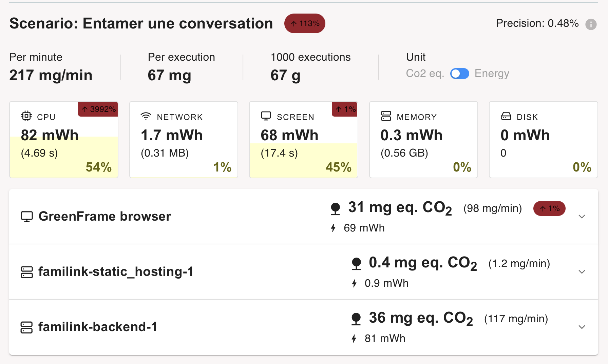
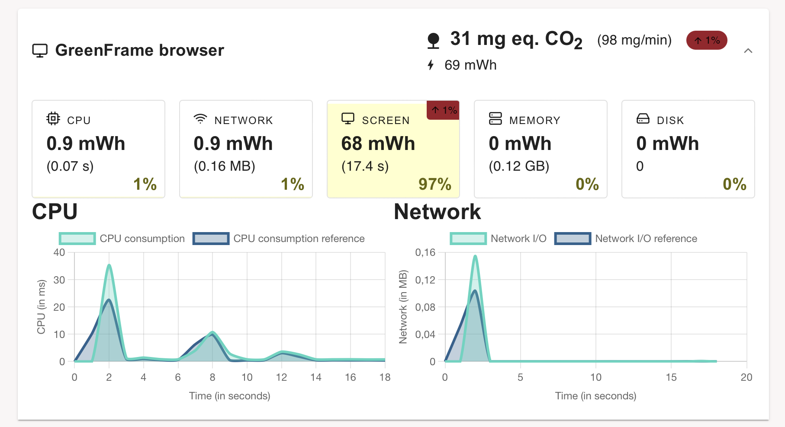
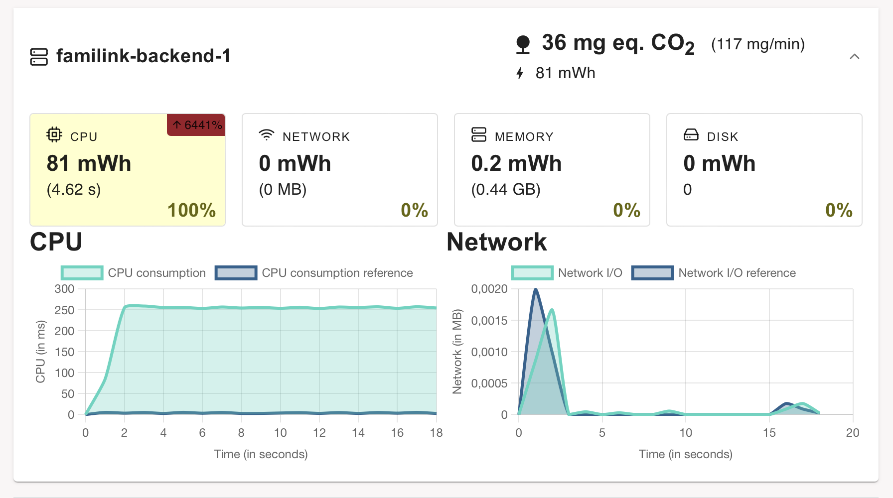
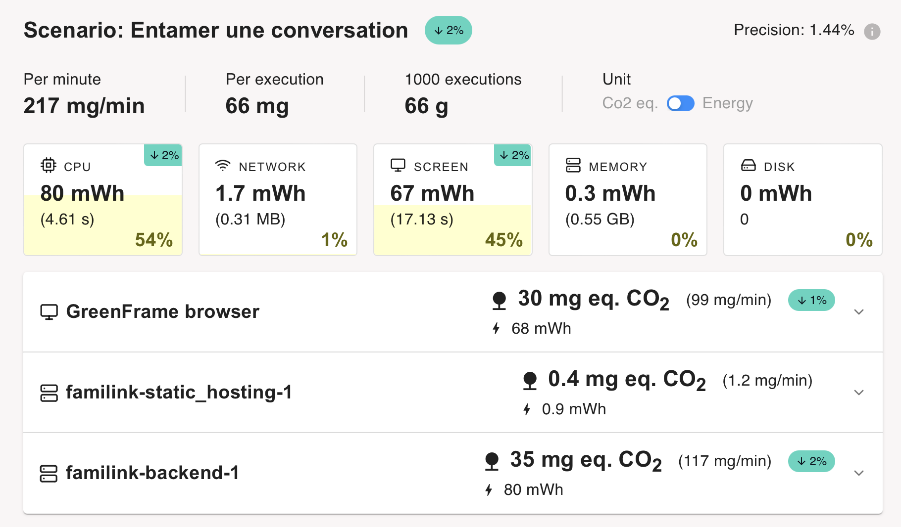

# FAMILINK
Se soucier de sa famille et de l’environnement
---

Choix du sujet 
---

Personnellement, nous utilisons chaque jour différentes messageries pour garder contact avec nos proches. Que ça soit pour contacter la famille dans un pays étranger ou pour garder contact avec des groupes d’amis pour des activités sportives, les messageries sont pour nous des outils essentiels.

De plus, notre exemple s’applique à l’ensemble du monde car il y aurait au dela de 5 Milliards d'individus qui utiliseraient des messagerie instantanées [(Source : Statista)]( https://fr.statista.com/statistiques/564407/applis-de-messagerie-mobiles-les-plus-populaires-dans-le-monde-en/) soit près de 70% de la population mondiale.

Utilité Sociale
---

Une famille comporte des caractéristiques propres qui ne s’appliquent pas nécessairement à d’autres groupes d’individus. En effet, une famille comporte jusqu’à 3 voire 4 générations et entretenir des liens malgré les aléas de la vie peut parfois s’avérer compliqué. Par exemple une mutation dans un poste éloigné ou encore le départ des enfants pour leurs études. De plus, ces différentes générations possèdent souvent des habitudes différentes, les personnes âgées se lèvent plus tôt et se couchent plus tôt tandis que les jeunes souvent plus tard, rendant les interactions plus compliquées. La messagerie offre aussi une alternative aux appels qui peuvent être chronophages et parfois perçus comme une corvée là ou ils devraient être un plaisir. De ce fait, grâce à la messagerie tout le monde répond quand il en a l’occasion et non plus par obligation. Ce dispositif permettrait donc d’éviter, ou à minima de limiter, l’isolation sociale et la solitude pour tous les membres de la famille.

Effets de la numérisation
---   

Il n’y a pas de réelle substitution physique à la messagerie instantanée à part peut-être les lettres qui ont rapidement disparu comme moyen de communication informelle après l’arrivée d’internet et des téléphones. A titre informatif une lettre verte envoyée par La Poste de Paris à Marseille consomme l’équivalent de 21,6 g de CO2[(Source : Jean-Pierre Guéno)](https://www.linkedin.com/pulse/mail-versus-courrier-papier-qui-est-le-bon-élève-jean-pierre-guéno/). Notre application est donc une réponse numérique à un problème qui n’en avait pas jusqu’alors. Cependant les messageries existantes sont beaucoup plus gourmandes qu’elles ne pourraient l’être notamment à cause :
- de l’ajout de publicités,
- du manque d’optimisation,
- de fonctionnalités supplémentaires sans réelle valeur ajoutée,
- de partage de fichiers volumineux.

Scénarios d'usage et impacts
---

Nous prenons pour hypothèse que notre utilisateur se connecte régulièrement à notre application afin de garder le contact avec les membres de sa famille. Prenant cela en considération, nos scénarios d'usage se baseront sur les deux comportements qui seront les plus observés chez nos utilisateurs : l'entame d'une conversation et la consultation des messages.

Scénario 1 : "Entamer une conversation"
---

1. L'utilisateur se rend sur l'application web
2. L'utilisateur sélectionne un contact
3. L'utilisateur rédige son message
4. L'utilisateur envoie son message

Scénario 2 : "Consulter ses messages"
---

1. L'utilisateur se rend sur l'application web
2. L'utilisateur selectionne une conversation
3. L'utilisateur selectionne une autre conversation
4. L'utilisateur selectionne une autre conversation
5. L'utilisateur selectionne une autre conversation

Impact de l'execution du scénario auprès du service concurrent Discord
---
L'EcoIndex d'une page (de A à G) est calculé (sources : [EcoIndex](https://www.ecoindex.fr/comment-ca-marche/), [Octo](https://blog.octo.com/sous-le-capot-de-la-mesure-ecoindex), [GreenIT](https://github.com/cnumr/GreenIT-Analysis/blob/acc0334c712ba68939466c42af1514b5f448e19f/script/ecoIndex.js#L19-L44)) en fonction du positionnement de cette page parmi les pages mondiales concernant :

- le nombre de requêtes lancées,
- le poids des téléchargements,
- le nombre d'éléments du document.

Nous avons décidé de comparer l'impact des scénarios sur les application web des messageries Discord et Whatsapp. Les résultats sont les suivants :

- [Scénario 1](https://github.com/UTT-GL03/FAMILINK/tree/main/GreenIT%20Data/Scenario_1)

#### Scénario appliqué avec Discord
  |       |EcoIndex|GES(gCO2e)|Taille du DOM|Requêtes|Taille de la page (ko)|
  |-------|--------|----------|-------------|--------|----------------------|
  |1. L'utilisateur se rend sur l'application web|51,18 D🟡| 1,98    |  225        |  116   |        25458         |
  |2. L'utilisateur sélectionne un contact ou un groupe de famille|27,29 E🟡| 2,45 | 647 | 216 | 29483 |
  |3. L'utilisateur rédige son message | 27,29 E🟡| 2,45 | 647 | 216 | 29483 |
  |4. L'utilisateur envoie son message | 26,71 E🟡 | 2,47 | 656 | 228 | 29533|

#### Scénario appliqué avec Whatsapp Web
  |       |EcoIndex|GES(gCO2e)|Taille du DOM|Requêtes|Taille de la page (ko)|
  |-------|--------|----------|-------------|--------|----------------------|
  |1. L'utilisateur se rend sur l'application web|35,26 E🟡| 2,29    |  733        |  92   |        31720         |
  |2. L'utilisateur sélectionne un contact ou un groupe de famille|19,74 F🟠| 2,61 | 891 | 237 | 32302 |
  |3. L'utilisateur rédige son message | 19,72 F🟠| 2,61 | 889 | 240 | 32303 |
  |4. L'utilisateur envoie son message | 19,25 F🟠 | 2,62 | 909 | 240 | 32303|
  
- [Scénario 2](https://github.com/UTT-GL03/FAMILINK/tree/main/GreenIT%20Data/Scenario_2)

#### Scénario appliqué avec Discord
  |       |EcoIndex|GES(gCO2e)|Taille du DOM|Requêtes|Taille de la page (ko)|
  |-------|-------------|----------|-------------|--------|----------------------|
  |1. L'utilisateur se rend sur l'application web|30,45 E🟡| 2,39    |  607        |  175   |        8064        |
  |2. L'utilisateur selectionne une conversation|30,45 E🟡| 2,39 | 607 | 175 | 8064 |
  |3. L'utilisateur selectionne une autre conversation | 26,56 E🟡| 2,47 | 655 | 240 | 9926 |
  |4. L'utilisateur selectionne une autre conversation | 17,73 F🟠 | 2,65 | 948 | 271 | 10336|
  |5. L'utilisateur selectionne une autre conversation | 6,22 G🔴 | 2,88 | 2144 | 294 | 10849|

#### Scénario appliqué avec Whatsapp Web
  |       |EcoIndex|GES(gCO2e)|Taille du DOM|Requêtes|Taille de la page (ko)|
  |-------|--------|----------|-------------|--------|----------------------|
  |1. L'utilisateur se rend sur l'application web|35,14 E🟡| 2,30    |  749       |  90   |        27319        |
  |2. L'utilisateur selectionne une conversation|18,94 F🟠| 2,62 | 923 | 239 | 32305 |
  |3. L'utilisateur selectionne une autre conversation |11,60 F🟠| 2,77 | 1359 | 255 | 33090 |
  |4. L'utilisateur selectionne une autre conversation | 11,48 F🟠 | 2,77 | 1370 | 255 | 33090|
  |5. L'utilisateur selectionne une autre conversation | 13,54 F🟠 | 2,73 | 1195 | 259 | 33256|

Chaque capture d'écran correspond à l'étape correspondante dans les scénarios avec le suffixe _ds pour discord et _ws pour whatsapp web. On peut remarquer que Discord est légèrement plus sobre ecologiquement que whatsapp excepté dans le cas du partage d'image ou de liens.

La réalisation de ces scénarios nous montre que l'impact écologique est déjà énorme dès l'arrivée sur le site, ensuite on voit que lors de la sélection d'une conversation le chargement des données a lui aussi un fort impact. Pour le premier point, on peut expliquer cela par la présence de publicités parfois ou encore de mauvaise optimisation de l'application. Pour ce qui est de la sélection des conversations, on peut remarquer que les conversations avec des liens, images ou encore des GIFs ont un grand impact. Pour ces raisons, notre applications n'aura bien évidemment pas de publicités, ne proposera pas l'envoi de fichiers multimédias (en tout cas dans un premier temps) et proposera un design simple et basique pour optimiser un maximum les performances.

Maquette de l'interface et échantillon de données
---

Notre travail portant sur un service de messagerie web, nous avons une seule interface qui nous permet de visualiser et comprendre les différents scénarios retenus.

__Fig.1__: Maquette de l'interface du prototype

Pour des raisons de respect des droits d'auteurs, nous utilisons des données générées (avec [`dummy-json`](https://dummyjson.com)).
Bien que fictives, ces données correspondent à la structure des services concurrents : un ensemble de conversation appartenant à un utilisateur (voir [modèle de données](./frontend/sample_data.hbs)).

## Prototype n°1 : Fonctionnalités pour le scénario prioritaire avec des données chargées de manière statique

Pour la première version de notre prototype: 

- les données sont chargées de manière statique.
- les  fonctionnalités implémentées sont la lecture et l'envoi des messages

Notre interface permet de charger dans la barre de discussion les conversations qu'on a avec différentes personnes et nous n'avons plus qu'à cliquer sur une conversation pour afficher les messages relatifs.

Lors du chargement de la page, nous avons une conversation qui s'affiche directement

### Conversations

_Fig.2_: Prototype 1 : affichage de la conversation de base

|    | EcoIndex | GES (gCO2e) | Taille du DOM | Requêtes | Taille de la page (ko) |
|----|----------|-------------|---------------|----------|------------------------|
| 1. L'utilisateur se rend sur l'application web | 79,21🟢 | 1.42 | 188 | 23 |  1296 |

_Tab1_: Evaluation de l'impact sur la page d'accueil

_Fig.3_: Prototype 1 : conversation avec Solal

|    | EcoIndex | GES (gCO2e) | Taille du DOM | Requêtes | Taille de la page (ko) |
|----|----------|-------------|---------------|----------|------------------------|
| 1. L'utilisateur sélectionne une conversation | 78,70🟢 | 1.43 | 188 | 28 |  1296

Comme nous l'avions prévu, l'interface étant très épuré et la seule présence de messages textuels rendent notre application respectueuse de l'environnement.

## Prototype n°2 : Fonctionnalités pour le scénario prioritaire avec données statiques chargées de manière dynamique

Dans cette nouvelle version du prototype, le frontend récupère désormais les données statiques via le réseau après un premier affichage vide. Cette approche, plus proche d’un fonctionnement réel, ajoute une requête par page affichée.

Sur le plan de l’impact environnemental, les résultats restent globalement inchangés par rapport à la version précédente, à l’exception d’une requête supplémentaire. À ce stade, l’EcoIndex ne devrait plus varier de manière notable, sauf en cas de changements importants. Pour aller plus loin, nous passerons à l’utilisation de GreenFrame, un outil d’analyse qui mesure de façon précise l’impact direct des consultations en s’appuyant sur les données d’utilisation des ressources matérielles (CPU, mémoire, réseau, disque), sans intégrer le cycle de vie du terminal. Cependant, étant donné que les différentes applications de messagerie possèdent toutes une étape d'identification, il est impossible pour nous de les analyser avec GreenFrame. C'est pour cette raison que pendant la suite de notre rapport nous serons dans l'incapacité de comparer notre application à des services existants et nous baserons donc seulement sur nos propres mesures.

Nous pouvons remarquer, que dans notre prototype, on a 2 pics significatifs de CPU à 1 et 7 secondes (voir Fig.4) et un pic de réseau lui aussi à 1 seconde. Contrairement à ce que nous pensions, le CPU et le réseau ne représentent que 5% de la consommation totale de notre application, les 95% restants sont quand à eux consommé par l'écran.

_Fig.4_: Prototype 2 : Impact du CPU et du Réseau

Le second atout de GreenFrame est que nous pouvons désormais simuler et mesurer la partie "serveur" de notre application (voir Fig.5). Cependant, pour cette partie, comme les données sont toujours statique, son impact est négligeable par rapport à la consommation du client (1,3%).

_Fig.5_: Prototype 2 : Impact du serveur

## Prototype n°3 : Fonctionnalités pour le scénario prioritaire avec données stockées dans une base de données

Pour cette troisième version du prototype, nous avons ajouté une base de données avec un API Web (CouchDB). L'intérêt pour nous de fonctionner avec une base de données est que dans on premier temps, la pagination de notre application pourra être facililité tout comme le filtrage des conversations. De plus, en étendant notre application à plus grande échelle nous pourrions avoir une base de données qui avec une simple requête pourrait fournir toutes les conversations de l'utilisateur connecté.

Comme nous n'avions pas fait les mesures GreenFrame avant d'ajouter le backend dans notre docker, nous ne pouvons pas remarquer la différence drastique causé par celui ci lors du passage du prototype 2 au prototype 3. Nous pouvons cependant remarquer que le passage à la Base de données a tout de même augmenter la consommation du CPU de 0,7 mWH avec 0,03 secondes d'utilisation de plus (voir Fig.6).

_Fig.6_: Comparaison des prototypes 2 et 3

Cette utilisation du CPU est bien visible grâce a GreenFrame dans la section backend qui représente l'utilisation de la base de données (voir Fig.7).

_Fig.7_ : Impact Ecologique de l'ajout de la base de données

Toutes ces mesures nous indique pour l'instant que l'ajout d'une base de données n'est pas bénéfique pour l'environnement, cependant ce choix de conception devrait être "rentabilisé" avec l'augmentation de la quantité de données à traiter et la façon dont on les traite.

## Prototype n°4 : Fonctionnalités pour le scénario prioritaire avec filtrage des données

### Passage à l'échelle 

Pour notre projet, je pense qu'un cas singulier se présente. En effet, dans le cadre d'une application de messagerie populaire, on parle de plusieurs milliers de milliards de messages par mois. A partir de ce postulat, plusieurs choix de conception peuvent être fait :  on peut supprimer les messages au bout d'un certain temps (comme le fait Snapchat par exemple), on peut limiter le nombre de message par personne ou bien ne rien faire et stocker tout les messages. Pour ce qui est de notre application, en admettant qu'elle serait utilisé uniquement pour parler aux membres de sa famille et ne serait pas l'application de messagerie principale des utilisateurs, on peut supposer que chaque utilisateur echange 10 messages par jour, soit 1000 messages au bout de 3 mois et un peu plus d'une semaine. En prenant cela en compte, il suffirait de 10 utilisateurs pour avoir une base de données de 10 000 messages en un peu plus de 3 mois. En multipliant par 100 le nombre d'éléments dans notre base de données, nous avons décidé de faire un premier test pour voir si notre application connaitrait une forte augmentation de son impact écologique. Il s'avère que ce n'est pas du tout le cas, aucun changement n'est observé du passage de 100 à 10 000 éléments (voir Fig.8). 

_Fig.8_ : Passage à 10 000 éléments

Comment expliquer cela ? D'un côté nous avons la partie affichage des messages, sans trop de doutes, en augmentant le nombre de message la différence est moindre car on ne charge qu'une seule discussion à la fois. Donc, plutot que de charger et d'afficher une dizaine de message, on en affiche entre environ 100. Etant donné que ces messages sont des simples chaines de caractères, pas des images ou des vidéos, cela n'a pas de réel impact. De l'autre côté, nous avons les boutons contenant le nom des interlocuteurs qui sont récupérés à l'aide d'un reduce qui est count, pour cette opération, toute la base de données doit être parcourus pour savoir si l'utilisateur connecté a intéragi ou non avec la susdite personne. De ce côté la, nous pourrions avoir un problème, puisque nous n'avons pas d'autres moyen pour pouvoir récupérer les informations sur les personnes si ce n'est celui-ci. Toutefois, CouchDB est tout de même sensé pouvoir gérer des bases de données volumineuses, pour vérifier cela, nous avons décider d'augmenter de 1 la puissance de 10 et d'essayer pour 100 000 élements(voir Fig.9).

_Fig.9_ : Passage à 100 000 éléments

Cette fois ci, on voit bien une différence très nette. Revenons à nos deux requêtes, après le passage de 10 000 à 100 000 éléments, le nombre de messages passent de 100 à  1000 par conversation. Ici, pour ce qui est du backend, il est fort probable que l'ajout des 100 000 éléments en eux-mêmes monopolisent l'utilisation du CPU et cause cette consommation extravagante que nous ne saurions corriger au vu du nombre de données en jeu (Voir Fig.10). Cependant, à ce stade, il est possible et même probable que le chargement d'un millier de message impacte notre application et puisse être en partie la raison de cette augmentation côté client (Voir Fig.11).

_Fig.10_ : Passage à 100 000 éléments

_Fig.11_ : Passage à 100 000 éléments

### Prise en compte du passage à l'echelle

Comme vous l'avez surement compris, pour réduire notre consommation de carbone, nous allons essayer de jouer sur le nombre de messages que nous chargons et allons réduire notre requête pour ne demander à la base de données qu'un nombre réduit de message. En effet, il n'est pas inhabituelle de consulter d'anciens messages, cependant ce n'est pas systématique. Nous allons donc faire le choix de ne charger par défaut que 20 messages.

### Evolution de l'impact environnemental après correction

Après cette correction, le resultat est mitigé. Nous avons bien réussi à réduire l'impact environnemental grâce à la pagination de nos résultats qui a réduit quelque peu l'impact à la fois coté client et coté serveur (Voir Fig.12), cependant nous sommes loin d'être revenu au point où nous étions avant le passage à l'echelle (Voir Fig.13).

_Fig.12_ : Impact environnemental après correction

_Fig.13_ : Évolution de l'impact de l'application avec l'augmentation de la quantité de données puis sa prise en compte.

### Perspectives

Le problème n'ayant toujours pas été réglé pour rattrapper cette grande augmentation de l'impact, il faudrait limiter le nombre de message par personnes pour essayer de rester sous la barre des 100 000 messages et avoir notre application qui fonctionne correctement. Toutefois, le problème pourrait simplement provenir de la machine que j'utilise actuellement dont les capacités ne permettraient pas l'hébergement d'une si grande base de données, là où un serveur le pourrait. En admettant que ca soit le cas, nous allons envisager les potentielles fonctionnalités à implémenter à notre application ensuite : 
- Ajouter un système de login,
- Ajouter un bouton pour charger les messages plus anciens,
- Ajouter le dernier messages sous le nom de l'interlocuteur et l'heure à laquelle il l'a envoyé dans la barre des discussions.

## Bilan

Au cours de ce semestre, nous avons travillé sur ce projet Familink qui s'est avéré plutôt complexe et nous pouvons constater que nous n'avons pu aborder qu'une petite partie de ce que représente une application de messagerie instantanée. Nous avons du faire face a plusieurs contre-temps en raison de la nature de notre projet (notamment la présence de login et parfois de captcha) pour accéder aux différentes applications déjà existantes rendant l'étude de celle-ci plus complexes voire parfois impossible. Cependant, nous avons pu acquérir des compétences à la fois en programmation mais surtout en analyse, permettant d'aborder avec un regard nouveau le développement d'applications web. Le suivi de cette UE nous a parfois réservé des surprises, comme l'importance de la consommation de l'écran qui s'avère être beaucoup plus importante que celle du CPU dont on à l'habitude d'entendre parler ou encore l'impact du nombre de requêtes sur la consommation de l'application.

